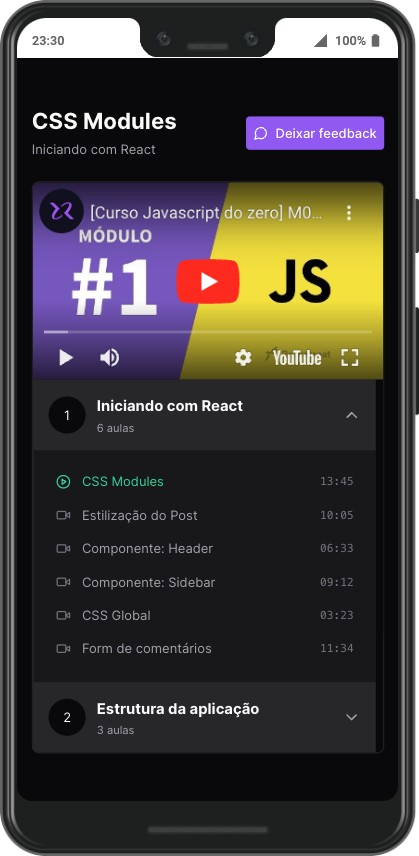
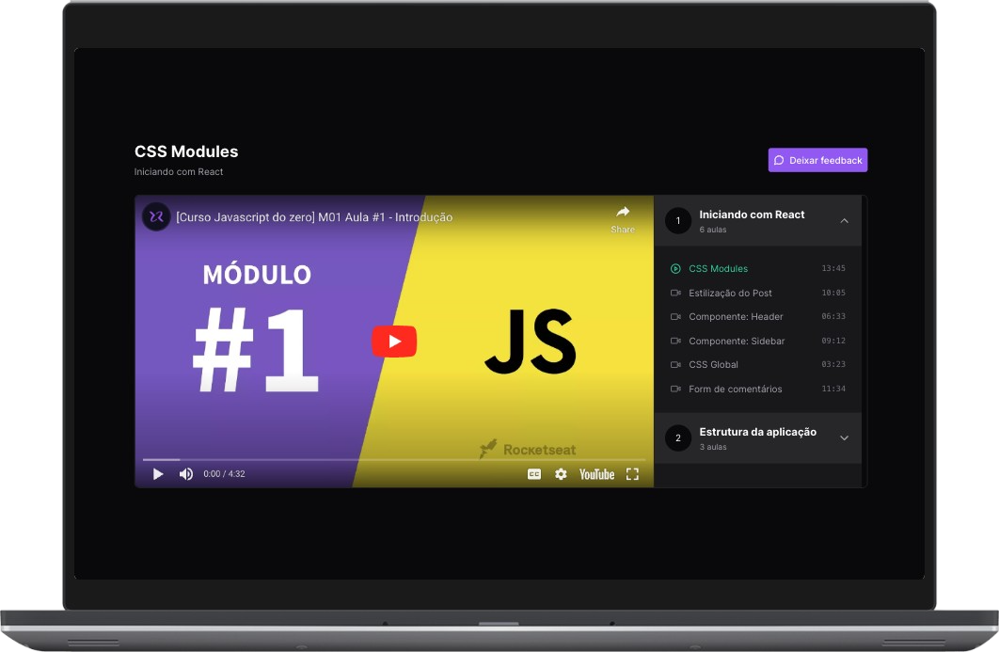

# Video Player with React and Redux

This project is an application that uses React and Redux to manage a video player.

### Preview
<table>
  <tr>
    <td align="center">Mobile</td>
    <td align="center">Desktop</td>
  </tr>
  <tr>
    <td></td>
    <td></td>
  </tr>
</table>

## Project Structure

```text
src/
├── api
├── clients
│   ├── axios
│   ├── graphql-requests
├── configuration
├── features                # Logic and UI of a especific feature
│   └── videoPlayer         # Video player feature
│       └── components      # Specific components of the feature

├── hooks                   # Global React custom hooks
├── modules                 # Business logic and state management
│   └── youtube             # Logic of how we use Youtube resources in this project
├── pages
├── services
├── shared
│   └── components
├── store
├── styles
├── tests
├── theme
```

## Definitions

- Collection:
- Video List:
- Video:


## Installation

```
bun install
```

## Development

To run the development workflow:

```
npm run dev
```


## Deployment

Make sure you are on the main branch, and that it is updated with the latest base code. This command uses the gh-pages package:

```
npm run deploy
```

## Credits

This project was created following the base code of an example from the Rocketseat platform and resources from Figma Community

### Design Attribution

The design of this application is based on, the "Skateboard Video Platform" designed by [@dwinawan](https://www.dwinawan.com). This design is licensed under the Creative Commons Attribution 4.0 International License (CC BY 4.0). We have adapted this design to fit the needs of our project while adhering to the terms of the CC BY 4.0 license.


#### Acknowledgments

- **Design Title**: Skateboard Video Platform
- **Designer**: [@dwinawan](https://www.dwinawan.com)
- **Source**: [Figma Community File](https://www.figma.com/community/file/990181064583275410/skateboard-video-platform)
- **License**: [Creative Commons Attribution 4.0 International (CC BY 4.0)](http://creativecommons.org/licenses/by/4.0/)
